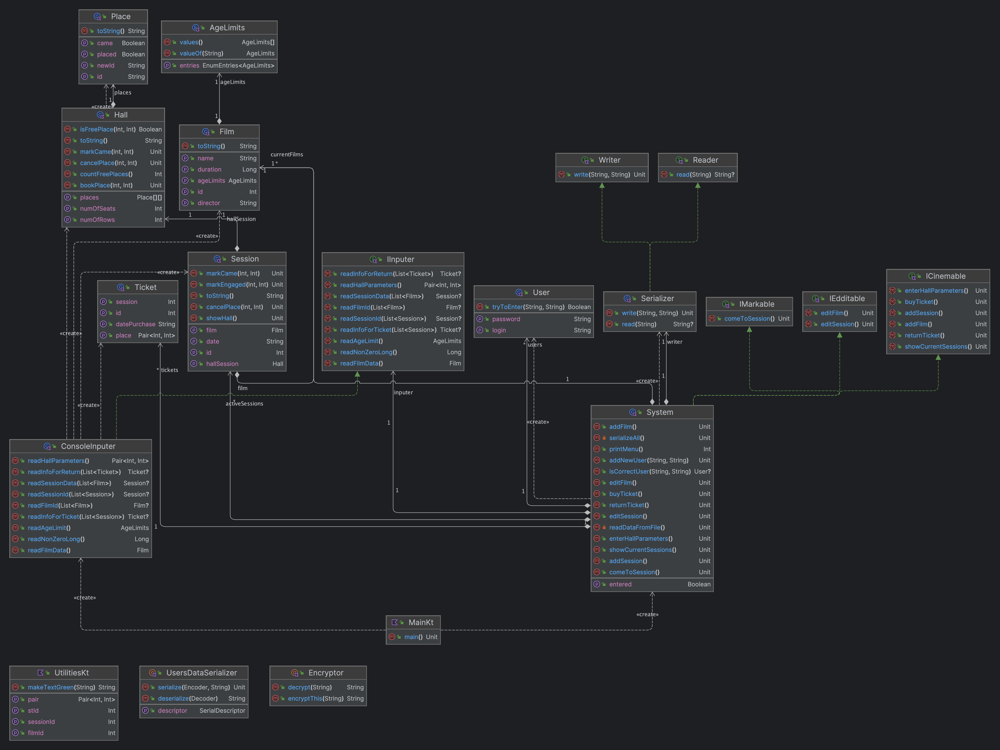
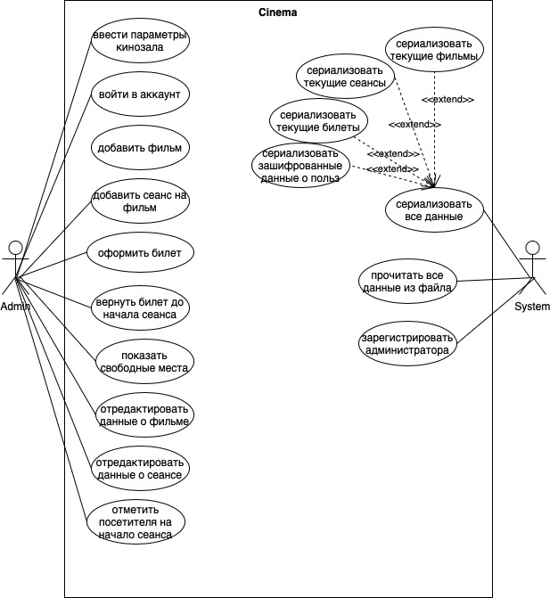

# КПО. ДЗ-1
### Тямин Илья Игоревич (БПИ-226)
## Как работать с программой?
1. Для запуска программы нужно запустить файл `Main.kt`. Если вы прежде никогда не запускали программу, то она Вас попросит ввести размеры зрительного зала: количество рядов (первое число) и количество сидений в каждом из рядов (второе число).
2. В программе реализован вход администраторов по логину и паролю. Соответственно, при первом входе Вам также нужно будет зарегистрироваться. В проекте реализован user-friendly интерфейс, поэтому все действия понятны и логически обоснованы. **Также стоит отметить, что все данные администраторов хранятся в зашифрованном виде, поэтому данные не могут быть перехвачены злоумышленниками.**

Далее пользователю будет предложено ввести одну из следующих команд:
1. Добавить фильм. 
> Данная команда добавляет фильм в репертуар кинотеатра. Для добавления фильма Вам потребуется его название, длительность в минутах, режиссер, возрастное ограничение (одно из следующих: 0+, 6+, 12+, 16+ или 18+). Возрастное ограничение также можно не указывать, тогда оно автоматически станет равным NotIndentified.
2. Добавить сеанс
> Данная команда может быть выполнена только если в системе находится хотя бы один фильм. Для создания сеанса потребуется выбрать id фильма (все доступные будут высвечены в консоль), а также дату и время сеанса. 
3. Оформить билет
> Данная команда может быть выполнена только если в системе находится хотя бы один сеанс, на котором осталось свободным хотя бы одно место. Для покупки билетоа потребуется выбрать id сеанса (все доступные будут выведены в консоль), а также ряд и место в одной строке через пробел. После покупки билета оформление другого билета на это место становится недоступным.
4. Вернуть билет
> Данная команда может быть выполнена только если в системе находится хотя бы один билет. Для возврата билета потребуется только ввести его id. После возврата место в кинозале станет доступным для покупки.
5. Показать свободные места на сеансы
> Необходимо выбрать id сеанса. После этого в консоль будет выведена схема кинозала, в котором отмечены занятые места (X), а также места, на которые уже пришли люди (+)
6. Редактировать данные о фильме
> Данная команда может быть выполнена только если в системе находится хотя бы один фильм. Далее пользователю будет предложено, что необходимо изменить: название (команда 1), длительность (команда 2), режиссера (команда 3), возрастное ограничение (команда 4).
7. Редактировать данные о сеансе
> Данная команда может быть выполнена только если в системе находится хотя бы один сеанс. Далее пользователю будет предложено изменить дату и время проведения сеанса (так как изменить в сеансе можно только ее). 
8. Отметить посетителя на начало сеанса
> Данная команда отмечает посетителя как пришедшего на сеанс (то, что его место точно занято). Для отметки необходимо указать id билета. После этого в соответствующем отображении кинозала появится знак + (там, где было куплено место по этому билету).
9. Выйти из программы
> Данная команда просто выходит из программы.

После выполнения одной команды, пользователю будет предложено выбрать еще одну, пока он не выберет команду "9" - выйти из программы.

### Некоторые важные вещи
Стоит отметить также некоторые важные вещи:
1. **После того, как человек выходит из программы, весь прогресс не стирается.** После того, как программа будет вновь запущена, данные будут восстановлены (записанные фильмы, сеансы, билеты и пользователи). Данные записываются в папке `data`, в формате `name.log`. Стоит также отметить, что логины и пароли записываются в зашифрованном виде. 
2. Данные записываются в формате `JSON`. Данный формат был выбран как удобно сериализуемый, он часто используется для хранения данных, реализации API. JSON также является довольно быстрым и удобно читаемым форматом, сериализация и десериализация JSON в Kotlin не требует особых усилий.
3. Программа не падает при неверно введеных данных, а запрашивает их еще раз. Также уделено особое внимание null-безопасности.

## Диаграммы
### Диаграмма классов
Чтобы рассмотреть подробнее можно нажать [сюда](diagram1.png)

### Диаграмма прецендентов
Чтобы рассмотреть подробнее можно нажать [сюда](diagram2.jpg)
